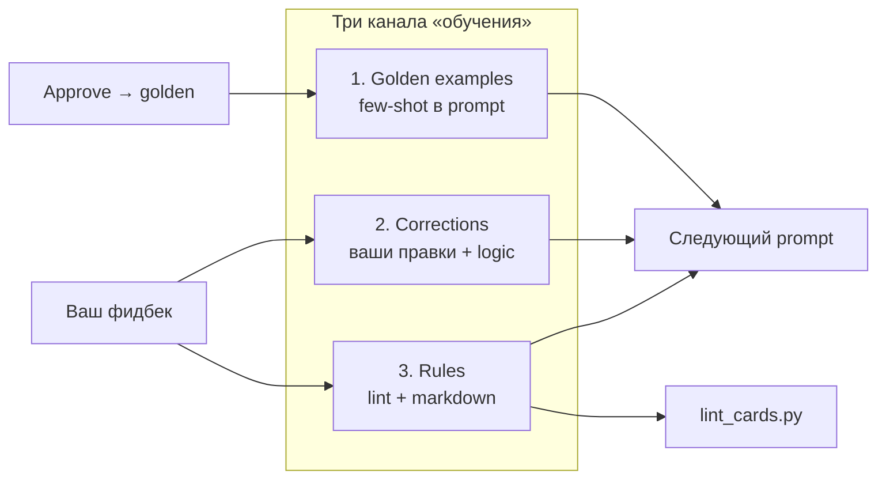
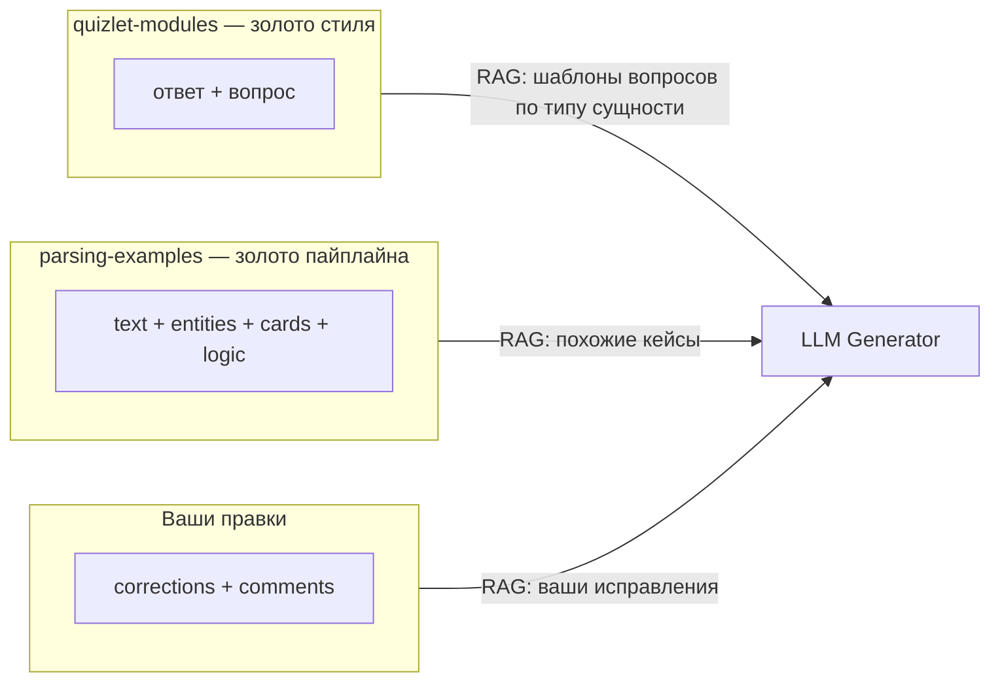
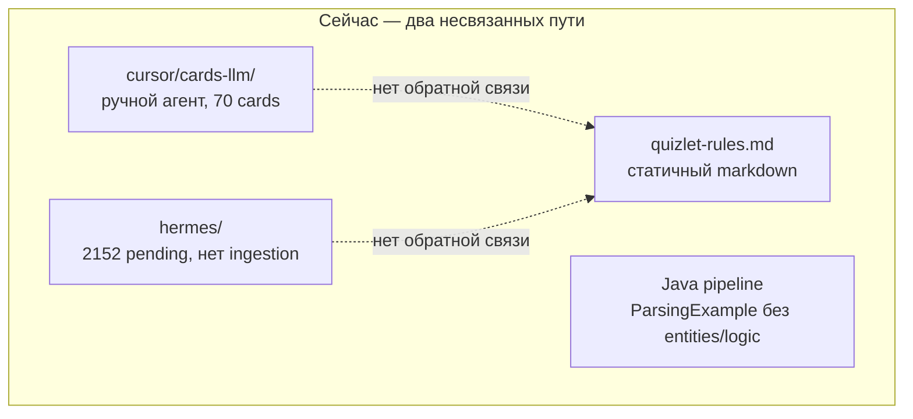
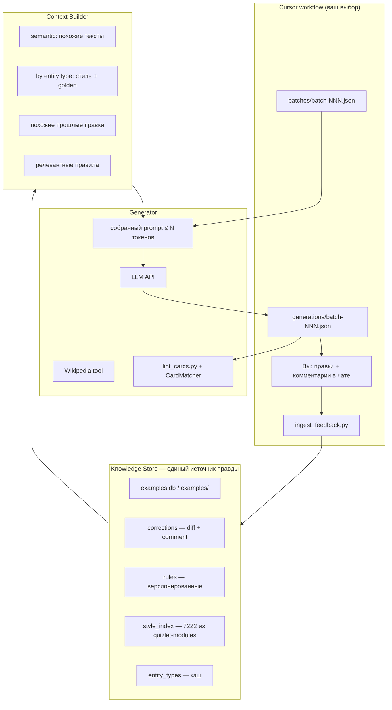
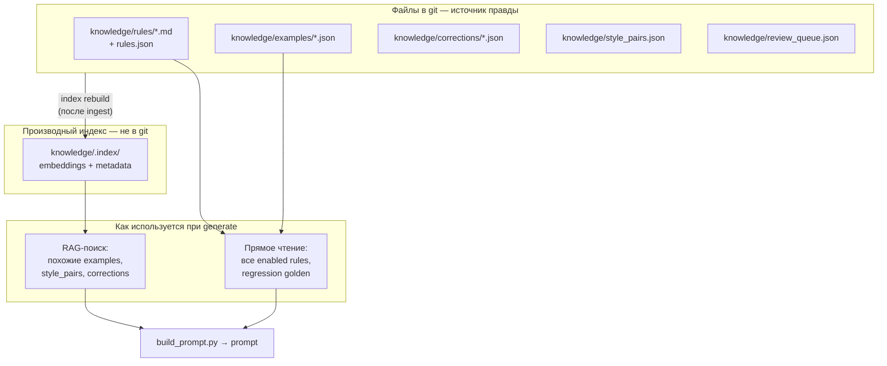
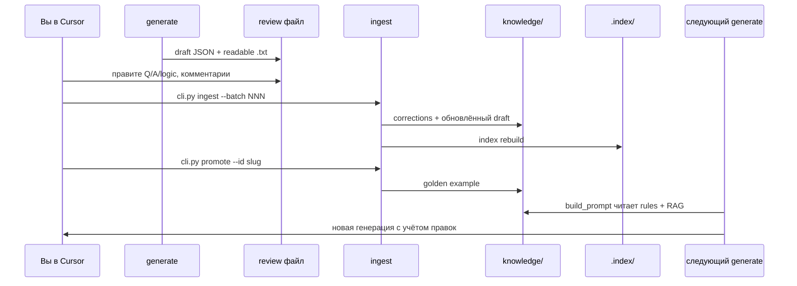
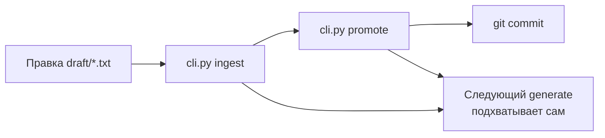

# Архитектура обучения на фидбеке для генерации карточек

> План реализации системы human-in-the-loop обучения для генерации ЧГК-карточек.
> Связанные документы: [`text_parsing_guide.md`](text_parsing_guide.md), [`cursor/cards-llm/README.md`](../cursor/cards-llm/README.md).

## Короткий ответ: fine-tune, RAG или что-то ещё?

| Подход | Нужен сейчас? | Роль |
|--------|---------------|------|
| **Fine-tune своей LLM** | **Нет** (фаза 2+, при 500+ размеченных text→cards) | Ускорение/дешевизна, если накопите стабильный датасет |
| **RAG + структурированная база** | **Да, ядро системы** | «Память» всех правок, примеров, правил — без потери контекста |
| **Правила (lint + markdown)** | **Да** | Жёсткие ограничения, которые не надо «вспоминать» |
| **LLM API (не Cursor-агент)** | **Желательно** | Программируемый цикл generate → review → retrieve |

**Свою LLM обучать не нужно** на старте. Ваша задача — не «запомнить 7222 карточки в весах модели», а **собирать растущую базу размеченных пар «исходный текст → entities → cards + logic»** и **динамически подставлять релевантный контекст** в каждый вызов. Это классический human-in-the-loop RAG, а не continual pre-training.

---

## Как именно происходит обучение

**Модель не меняется.** Меняется то, что она видит перед каждым вызовом, и набор жёстких проверок после. Это три канала обучения:



### Канал 1: Примеры (few-shot learning в prompt)

Каждый одобренный вами пример становится **эталоном для похожих задач**.

1. Вы правите карточки → `ingest_feedback.py` сохраняет финальный вариант
2. Вы делаете `promote` → статус `golden`, пример индексируется embedding'ом текста
3. При генерации для нового сообщения `build_prompt.py` ищет 3–5 **семантически похожих** golden examples и вставляет их в prompt целиком: `text → entities → cards + logic`

**Что улучшается:** модель копирует паттерны с похожих кейсов (цитаты, multi-card, link+comment).

**Аналогия:** не экзамен, а шпаргалка с решёнными задачами того же типа.

### Канал 2: Правки (corrections как анти-примеры)

Не только финальный результат, но и **что было не так**.

Запись в `corrections`:
```json
{
  "example_id": "pickle-rick-episode",
  "card_index": 0,
  "before": {"question": "В этой серии ОН превратился в огурец", "answer": "Рик Санчез"},
  "after": {"question": "В эпизоде Pickle Rick ОН превратился в огурец", "answer": "Рик Санчез"},
  "comment": "Вопрос неоднозначен без названия эпизода",
  "tags": ["ambiguity", "episode-name"]
}
```

При следующей генерации, если текст похож (тот же тег `ambiguity` или embedding близок):
- в prompt попадает блок **«Ошибка, которую уже исправляли»**: before → after + ваш comment
- модель видит конкретный diff, а не абстрактное правило

**Что улучшается:** повторение одной и той же ошибки на похожих текстах должно снижаться.

### Канал 3: Правила (кристаллизация фидбека)

Когда одна и та же правка повторяется 2–3 раза (или вы явно пишете `rule:`), комментарий **промотируется в правило**:

| Уровень | Где живёт | Как влияет |
|---------|-----------|------------|
| Soft rule | `knowledge/rules/` + prompt | Попадает в core rules, если тег совпадает |
| Hard rule | `lint_cards.py` | Блокирует плохой output до вашего ревью |

Пример эволюции (уже было вручную в run 1→3):
- Фидбек: «однокоренные слова в вопросе и ответе» (×5 раз)
- → Rule 16 в `quizlet-rules.md`
- → Проверка в `lint_cards.py` (hard)
- → Больше не нужно напоминать в каждом prompt

**Что улучшается:** системные ошибки уходят в автоматику, prompt не раздувается.

### Конкретный цикл на одном сообщении

```
День 1: generate("Бродский: Если Евтушенко против, то я за")
        → модель ошиблась (не тот порядок ОН)
        → вы правите + comment: "две персоналии — две карточки, ОН по очереди"
        → ingest → correction сохранён

День 5: generate("Пастернак: Нобелевку я бы отдал Евтушенко")
        → RAG находит golden "txt-001" (Бродский/Евтушенко) similarity 0.82
        → RAG находит correction про две персоналии
        → prompt содержит оба → модель генерирует правильнее

День 20: ещё 3 похожих правки про multi-personalia
        → promote comment → rule "multi-personalia-quote"
        → lint не нужен, rule в core prompt всегда
```

### Что НЕ является обучением

| Действие | Обучается? | Почему |
|----------|------------|--------|
| Просто сгенерировать 5000 карточек без ревью | Нет | Нет фидбека → нечего сохранять |
| Импортировать quizlet-modules | Частично | Только стиль вопросов, нет связи с исходным текстом |
| Менять prompt вручную без ingest | Нет | Правка теряется при следующем батче |
| Fine-tune на 50 примерах | Вредно | Переобучение, правила 13–16 не обновить без переобучения |

### Как quizlet-modules участвуют в обучении

7222 пары **не учат «текст → карточки»**, но учат **формулировке вопроса**:

```
Новая сущность: entity_type = NICKNAME, answer = "Мальчик, который выжил"
    → RAG из style_pairs: top-3 вопроса для NICKNAME
    → "ЭТО ПРОЗВИЩЕ, ТАКОЕ ПРОЗВИЩЕ" / "Мальчик, который выжил" ↔ "Гарри Поттер"
    → модель видит шаблон, не выдумывает "Какое прозвище у Гарри?"
```

Плюс `entities-llm` может заранее классифицировать ответы из modules → кэш типов для 6000+ уникальных ответов.

### Когда качество реально растёт

| Этап | Примеров golden | Ожидание |
|------|-----------------|----------|
| Старт | 7 + 70 | Много правок, RAG слабый |
| После 50 ревью | ~120 | Похожие тексты начинают попадать в контекст |
| После 200 ревью | ~270 | Правила кристаллизованы, edit distance падает |
| После 500 ревью | ~570 | Стоит оценить fine-tune entity classifier |
| 2000+ ревью | ~2000+ | RAG покрывает большинство паттернов Telegram |

**Метрика успеха:** среднее число правок на карточку падает с ~2.0 до ~0.3 за 200 примеров (ориентир, не гарантия).

### Почему контекстное окно не теряется

- Вся история (5000+ examples, все corrections) — в **store + embedding index** (десятки МБ на диске)
- В prompt попадает только **релевантный срез** (~3–8K токенов), собранный retrieval'ом
- Лог `retrieval_log.json`: какие examples/rules попали в контекст — для отладки «почему опять ошибся»

---

## Важное про quizlet-modules

В [`quizlet-modules/`](../quizlet-modules/) лежит **7222 карточки** формата `ответ\tвопрос` — без исходного Telegram-текста, без `entities`, без `logic`.



**5000+ примеров из quizlet-modules** используются для:
- retrieval стиля: «как формулировать вопрос для PERSONALIA_MALE / NICKNAME / PAINTING»
- кэш типов сущностей (уже начато в [`cursor/entities-llm/`](../cursor/entities-llm/))
- автоматическая проверка стиля (embedding similarity, `lint_cards.py`)

**НЕ используются** напрямую для обучения «текст сообщения → карточки» — для этого нужны Telegram-сообщения + ваши правки.

---

## Текущее состояние (что уже есть)



Пробелы, которые нужно закрыть:
- [`ParsingExample.java`](../src/main/java/com/quizlet/parser/examples/ParsingExample.java) не хранит `entities` и `logic` — богатый JSON из LLM теряется при round-trip в Java
- [`LlmCardEnricher.java`](../src/main/java/com/quizlet/parser/enricher/LlmCardEnricher.java) — заглушка
- [`hermes/pending-batch-01.json`](../hermes/pending-batch-01.json) ожидает правки, но ничто их не читает
- Улучшения rules 13–16 делались вручную (run 1→3 в [`cursor/cards-llm/README.md`](../cursor/cards-llm/README.md))

---

## Целевая архитектура



### Где хранятся правила и знания: файлы + производный RAG-индекс

**Ответ: и то, и другое, но с разными ролями.**

| Слой | Что | Формат | В git? | Назначение |
|------|-----|--------|--------|------------|
| **Source of truth** | Правила, примеры, правки | JSON + Markdown | **Да** | Редактируете, диффите, откатываете |
| **Derived index** | Embedding-векторы для поиска | `knowledge/.index/` (sqlite-vec или chromadb) | **Нет** (`.gitignore`) | Быстрый semantic search, пересобирается из файлов |
| **Runtime cache** | Собранный prompt на батч | `knowledge/prompts/batch-NNN.md` | Опционально | Прозрачность: видите, что ушло в LLM |



**Правила — в основном файлы, не RAG.** Их мало (десятки, не тысячи), они должны попадать в prompt **детерминированно**:
- `knowledge/rules/core.md` — всегда в prompt (топ-правила + чеклист)
- `knowledge/rules/positive/` — хорошие паттерны (можно подмешивать по тегам)
- `knowledge/rules/negative/` — анти-паттерны (аналог [`quizlet-rules-bad.md`](../hermes/quizlet-rules-bad.md))
- `knowledge/rules/rules.json` — машиночитаемый реестр: `{id, text, tags[], type, enabled, lint_check?}`

Существующие [`hermes/quizlet-rules.md`](../hermes/quizlet-rules.md) и [`parsing-examples/parsing-examples.json`](../parsing-examples/parsing-examples.json) мигрируют в `knowledge/`, но остаются **читаемыми файлами**.

**RAG — только для больших коллекций**, где нельзя засунуть всё в prompt:

| Коллекция | Размер | Хранение | Retrieval |
|-----------|--------|----------|-----------|
| `examples` (golden) | растёт: 80 → 2000+ | JSON-файлы + embedding в `.index/` | top-5 по similarity текста |
| `corrections` | растёт с каждой правкой | JSON + embedding comment/diff | top-3 по тегам + similarity |
| `style_pairs` | 7222 | один JSON + embedding по `answer`+`question` | top-3 по `entity_type` |
| `entity_cache` | ~6270 | JSON | точный lookup по имени ответа |
| `rules` | ~30–100 | **markdown/json, без RAG** | фильтр по `tags`, не semantic search |

### Структура каталога `knowledge/`

```
knowledge/
├── rules/
│   ├── core.md              # всегда в prompt
│   ├── rules.json           # реестр + enabled + lint_check
│   ├── positive/            # примеры хорошо (как quizlet-rules examples 1-16)
│   └── negative/            # примеры плохо (как quizlet-rules-bad)
├── examples/
│   ├── golden/              # один файл на пример: brodsky-evtuhsenko.json
│   └── draft/               # ещё не promoted
├── corrections/
│   └── 2025-06-12-pickle-rick.json
├── style_pairs.json         # импорт из quizlet-modules
├── entity_cache.json        # answer → entity_type
├── review_queue.json        # очередь Telegram-сообщений
├── .index/                  # .gitignore — пересобирается командой index rebuild
│   └── vectors.sqlite
├── prompts/                 # сгенерированные prompt'ы (для отладки)
└── cli.py                   # next, generate, ingest, promote, index rebuild
```

### Слой 1: Knowledge Store (детали сущностей)

| Сущность | Файл | Поля |
|----------|------|------|
| `examples` | `examples/golden/{id}.json` | `{id, message_id, text, tags, entities[], cards[{q,a,logic}], status}` |
| `corrections` | `corrections/{date}-{id}.json` | `{example_id, card_index, before, after, comment, tags}` |
| `rules` | `rules/rules.json` + `rules/*.md` | `{id, text, type, tags, enabled, lint_check?, source_correction_id?}` |
| `style_pairs` | `style_pairs.json` | `{answer, question, entity_type?, category}` |
| `review_queue` | `review_queue.json` | `{message_id, text, status}` |

**Статусы примера:** `draft` → `reviewed` → `golden` → `regression` (всегда в тестах).

**Workflow хранения:**
1. Вы правите → `ingest` пишет JSON-файлы
2. `index rebuild` обновляет `.index/` (5–30 сек на 8000 записей)
3. `promote` копирует draft → golden, добавляет в regression pool
4. Git commit — вы видите diff правил и примеров, как сейчас с `quizlet-rules.md`

**Почему не «только RAG»:** векторная БД плохо диффится, неудобно править руками, нельзя откатить одно правило. Файлы — для человека и git; индекс — одноразовый кэш для поиска.

**Почему не «только файлы без RAG»:** при 2000+ examples нельзя читать все и выбирать глазами — нужен semantic search по embedding'ам. Но это **тонкий слой поверх файлов**, не отдельная база знаний.

### Слой 2: Context Builder (решает проблему контекстного окна)

Вместо «засунуть всё в prompt» — **сборка контекста по запросу** (~3–8K токенов):

1. **Всегда** — компактные core rules (топ-20 правил + чеклист из [`generate_cards_prompt.md`](../cursor/cards-llm/generate_cards_prompt.md))
2. **Semantic RAG** — 3–5 похожих `examples` по embedding исходного текста (cosine similarity)
3. **Entity-style RAG** — 2–3 пары из `style_pairs` на каждый предсказанный тип сущности
4. **Correction RAG** — если похожий текст уже правили: «в прошлый раз вы сказали: …» + diff
5. **Negative rules** — правила из corrections с тегом `negative` (аналог example 17)

Индексация: `chromadb` / `sqlite-vec` / простой JSON + `sentence-transformers` локально. Для 7222 + сотни examples — достаточно локального embedding без облака.

**Ключевой принцип:** контекстное окно LLM — только «рабочая память»; вся история — в store + retrieval.

### Слой 3: Generator

Эволюция текущего [`cursor/cards-llm/`](../cursor/cards-llm/):

```
extract_candidates.py → split_batches.py
    → build_prompt.py (NEW: читает knowledge store + retrieval)
    → LLM API call (NEW: не только ручной Cursor-агент)
    → generations/batch-NNN.json
    → lint_cards.py
    → [вы ревьюите в Cursor]
    → ingest_feedback.py (NEW)
```

`build_prompt.py` генерирует **один markdown-файл на батч** с уже подставленным контекстом — вы продолжаете работать в Cursor, но контекст собирается автоматически из всей накопленной базы.

### Как вы исправляете карточки и как они попадают «в модель»

**«Загрузка в модель» = не fine-tune.** Веса LLM не меняются. После ваших правок данные сохраняются в `knowledge/`, пересобирается индекс, и **следующий** `generate` автоматически подставляет их в prompt через `build_prompt.py`.



#### Шаг 1: Генерация → файлы для ревью

```bash
python knowledge/cli.py generate --batch 001
```

Создаёт три артефакта (как сейчас в [`parsing-examples-cursor.txt`](../cursor/cards-llm/parsing-examples-cursor.txt), но в `knowledge/`):

| Файл | Для чего |
|------|----------|
| `knowledge/draft/batch-001.json` | Машинный формат — source of truth после правок |
| `knowledge/draft/batch-001.txt` | **Человекочитаемый** — удобно ревьюить в Cursor |
| `knowledge/prompts/batch-001.md` | Что ушло в LLM (для отладки) |

Формат `.txt` — тот же, что уже знаком:

```
===== pickle-rick-episode =====
TEXT:
<исходное сообщение>
MESSAGE_ID: -999905327
TAGS: link+comment, multi-card

ENTITIES:
  - Рик Санчез [PERSONALIA_MALE]

CARDS:
[1]
Q: В этой серии ОН превратился в огурец.
A: Рик Санчез
LOGIC: ...

[2]
...
```

#### Шаг 2: Вы правите (два способа, можно вместе)

**Способ 1 — правка файла (основной):**

Открываете `knowledge/draft/batch-001.txt` или `.json` в Cursor и:
- меняете `Q:` / `A:` / `LOGIC:`
- удаляете карточку целиком (REJECT)
- добавляете новую карточку `[3]`
- правите `ENTITIES`

**Способ 2 — комментарий в чате Cursor** (для правил, не для мелких правок):

```markdown
## pickle-rick-episode
- card 1: REJECT — вопрос неоднозначен без названия эпизода
- card 2: OK
- rule: всегда называть эпизод по имени, не «этой серии»
```

Агент (или вы сами) переносит это в `.txt`/`.json`, либо `ingest` парсит `reviews/batch-001.md` если вы его сохранили.

**Рекомендация:** мелкие правки Q/A — прямо в файле; обобщения («всегда так делай») — `rule:` в комментарии или в `LOGIC:`.

#### Ежедневный workflow: файл → ingest → git

**Коротко: да, вы правите файл. Но одного git commit недостаточно — нужен `ingest`.**

| Шаг | Что делаете | Зачем |
|-----|-------------|-------|
| 1 | Правите `knowledge/draft/batch-001.txt` (или `.json`) | Исправляете карточки |
| 2 | `python knowledge/cli.py ingest --batch 001` | Система вычисляет diff, пишет `corrections/`, обновляет RAG-индекс |
| 3 | `python knowledge/cli.py promote --id slug` | Хорошие примеры → `examples/golden/` |
| 4 | `git add knowledge/ && git commit` | Сохраняете обучение в истории (вручную, когда довольны батчем) |



**Почему не «просто править и коммитить»:**

- Git хранит **финальный текст** файла, но не структуру `before → after` + теги для RAG
- `ingest` создаёт отдельные `corrections/*.json` — именно их ищет semantic search при следующей генерации
- `ingest` пересобирает `.index/` — без этого RAG не видит новые данные
- Snapshot оригинала (`generations/batch-001.json`) не перезаписывается — diff всегда воспроизводим

**Что коммитить в git:**

| Путь | В git? |
|------|--------|
| `knowledge/draft/` | Да — рабочие правки |
| `knowledge/corrections/` | **Да** — главная ценность обучения |
| `knowledge/examples/golden/` | **Да** |
| `knowledge/rules/` | **Да** |
| `knowledge/generations/` | Да — snapshot до правок |
| `knowledge/.index/` | **Нет** — `.gitignore`, пересобирается из файлов |
| `knowledge/prompts/` | Опционально — для отладки |

**Типичная сессия в Cursor (5 сообщений):**

```
1. generate --batch 002
2. Открываете draft/batch-002.txt, правите 3 карточки из 12
3. ingest --batch 002
4. promote для 4 примеров, где всё ок (остальные остаются draft)
5. git commit -m "cards: batch 002 review, 4 golden, 3 corrections"
6. generate --batch 003  ← уже с учётом шага 3–4
```

**Синхронизация .txt ↔ .json:** после правки `.txt` запускаете `ingest` (он парсит txt → json) или отдельно `cli.py sync --batch 001` если правили только txt. Рекомендация: **править `.txt`**, ingest сам обновит json.

**Альтернатива — править только `.json`:** если удобнее структурированный формат, ingest читает json напрямую. `.txt` перегенерируется для чтения.

#### Шаг 3: Ingest — сохранение правок

```bash
python knowledge/cli.py ingest --batch 001
```

Скрипт сравнивает **оригинал генерации** (`generations/batch-001.json` snapshot) с **вашей версией** (`draft/batch-001.json`):

| Действие | Куда пишется |
|----------|--------------|
| Изменили Q/A | `knowledge/corrections/2025-06-12-pickle-rick.json` с `before`/`after` |
| Обновили LOGIC | в correction + в draft example |
| REJECT карточки | `corrections` с `action: reject` |
| Добавили карточку | в draft example, correction с `action: add` |
| Написали `rule:` | `knowledge/rules/rules.json` как `candidate` (enabled: false) |

Затем автоматически: `index rebuild` — embedding'и обновлены.

#### Шаг 4: Promote — «обучить» систему на этом примере

```bash
python knowledge/cli.py promote --id pickle-rick-episode
```

- `draft` → `knowledge/examples/golden/pickle-rick-episode.json`
- Статус `golden` → участвует в RAG (semantic search)
- Синхронизация в [`parsing-examples/parsing-examples.json`](../parsing-examples/parsing-examples.json) для Java regression
- `CardMatcher` тест не даёт регрессировать

**Без `promote`** правки живут только в `corrections` (анти-примеры). **С `promote`** — ещё и положительный few-shot example.

#### Шаг 5: Следующая генерация — как правки попадают в LLM

При `generate` для нового сообщения `build_prompt.py` собирает prompt:

```
┌─────────────────────────────────────────┐
│ CORE RULES (из knowledge/rules/core.md) │  ← всегда, включая ваши promoted rules
├─────────────────────────────────────────┤
│ GOLDEN EXAMPLES (RAG top-5)             │  ← ваши promoted примеры, похожие тексты
├─────────────────────────────────────────┤
│ CORRECTIONS (RAG top-3)                   │  ← «на похожем кейсе вы исправили так»
├─────────────────────────────────────────┤
│ STYLE PAIRS (по entity_type)              │  ← из quizlet-modules
├─────────────────────────────────────────┤
│ НОВОЕ СООБЩЕНИЕ                           │
└─────────────────────────────────────────┘
```

Вы **ничего вручную не подгружаете** — `ingest` + `promote` обновили store, `generate` сам подтянул.

Пример: после правки pickle-rick, генерация для другого Rick and Morty эпизода получит в prompt:
- golden `pickle-rick-episode` (если similarity высокий)
- correction: «не "этой серии", а название эпизода»
- rule: `episode-name-required` (если вы сделали promote rule)

#### Промоушен правил отдельно

```bash
python knowledge/cli.py rules approve episode-name-required
```

Rule переходит `candidate → enabled`, попадает в `core.md` или подмешивается по тегу `ambiguity`. Если у rule есть `lint_check` — дописывается проверка в `lint_cards.py`.

#### Слой 4: Feedback ingestion (технические детали)

- Snapshot оригинала генерации хранится в `knowledge/generations/batch-NNN.json` (не перезаписывается)
- Draft — рабочая копия для правок
- `reviews/batch-NNN.md` — опциональный файл с чат-комментариями
- Regression: golden examples всегда проходят [`ParsingExamplesGoldenTest.java`](../src/test/java/com/quizlet/parser/examples/ParsingExamplesGoldenTest.java)

### Слой 5: Rule evolution (не только RAG)

Комментарии типа «не однокоренные слова» уже стали rules 13–16 вручную. Автоматизировать:

1. Comment → LLM-extract candidate rule (опционально)
2. Вы approve → rule в `knowledge/rules/`
3. Rule попадает в core rules если часто срабатывает
4. `lint_cards.py` расширяется для проверяемых правил (как сейчас однокоренность)

**Два уровня правил:**
- **Hard** (lint, Java) — однокоренность, длина ответа, banned words
- **Soft** (prompt + RAG) — стиль формулировок, сохранение реалий из текста

---

## Cursor-workflow: как это выглядит на практике

### Фаза 0 — bootstrap (1–2 дня)
- Импорт `quizlet-modules` → `knowledge/style_pairs.json` (скрипт на базе [`extract_style_samples.py`](../cursor/cards-llm/extract_style_samples.py))
- Миграция `parsing-examples.json` + `parsing-examples-cursor.json` → `knowledge/examples/`
- Embedding-индекс

### Фаза 1 — цикл на 1 сообщение
```bash
python knowledge/cli.py next --count 1        # взять из очереди
python knowledge/cli.py generate --id msg-2343  # LLM + RAG context
# ревью в Cursor, правки в JSON
python knowledge/cli.py ingest --id msg-2343
python knowledge/cli.py promote --id msg-2343   # → golden
```

### Фаза 2 — батчи по 5 (как сейчас)
Тот же цикл, но `split_batches.py` читает очередь из store, а не статичный `candidates.json`.

### Фаза 3 — масштаб на 2000+ Telegram
- Очередь из [`hermes/pending.json`](../hermes/pending.json) (2152) + полный Telegram export
- Приоритет: сообщения с тегами `text-only`, `multi-card` (сложнее)
- Метрики: % approved без правок, среднее число правок на карточку, lint pass rate

---

## Когда имеет смысл fine-tune

Только когда накопите **500+ примеров** с полным циклом `text → entities → cards` и стабильными правилами:

| Задача | Fine-tune кандидат |
|--------|-------------------|
| Entity extraction из текста | Small classifier или LoRA на 7B |
| Question formatting по типу | LoRA на формат вопроса |
| End-to-end text→cards | Дорого, RAG обычно достаточно |

До этого fine-tune даст **переобучение на малых данных** и **заморозит правила** — каждое новое правило 13–16 потребует переобучения. RAG + rules обновляются мгновенно.

---

## Что менять в существующем коде

| Файл / модуль | Изменение |
|---------------|-----------|
| [`ParsingExample.java`](../src/main/java/com/quizlet/parser/examples/ParsingExample.java) | Добавить `entities`, `logic`, `messageId`, `status` |
| [`LlmCardEnricher.java`](../src/main/java/com/quizlet/parser/enricher/LlmCardEnricher.java) | Реализовать вызов API + чтение golden overlay из knowledge store |
| [`cursor/cards-llm/`](../cursor/cards-llm/) | `build_prompt.py`, `ingest_feedback.py`, подключение к `knowledge/` |
| [`hermes/`](../hermes/) | Объединить pending-очередь с `knowledge/review_queue` |
| Новый [`knowledge/`](../knowledge/) | Store, retrieval, CLI |

---

## Метрики «обучается ли система»

Без метрик кажется, что учится, но это иллюзия. Отслеживать:

- **Edit distance** — насколько меняете карточки после генерации (должен падать)
- **Lint pass rate** — % батчей без ошибок lint
- **Approval rate** — % карточек без правок
- **Regression** — golden examples всегда проходят `CardMatcher`
- **Retrieval hit** — в логе: какие examples/rules попали в контекст (для отладки)

---

## Риски и как их снять

| Риск | Решение |
|------|---------|
| RAG тащит нерелевантные примеры | Фильтр по `tags` + entity types + min similarity threshold |
| Правила противоречат друг другу | Версионирование rules, `enabled: false` вместо удаления |
| Дубли в examples | Dedup по `normalize(text)` (уже есть в [`ParsingExamplesLoader`](../src/main/java/com/quizlet/parser/examples/ParsingExamplesLoader.java)) |
| Cursor-агент не вызывает API стабильно | Отдельный `generate.py` с OpenAI/Anthropic API; Cursor только для ревью |
| quizlet-modules ≠ формат QuizletTsvWriter | Зафиксировать `answer\tquestion` в STYLE_GUIDE и writer |

---

## Рекомендуемый порядок внедрения

1. **Knowledge store** + импорт существующих examples и style_pairs
2. **build_prompt.py** с retrieval (сразу почувствуете эффект на 20 candidates)
3. **ingest_feedback.py** — замыкание цикла
4. Расширить Java-модели + regression tests
5. Масштабировать очередь (hermes pending → knowledge)
6. Fine-tune — только если edit distance перестанет падать при 500+ golden

---

## Implementation todos

- [ ] Создать `knowledge/` store: examples, corrections, rules, style_pairs, review_queue
- [ ] Импорт parsing-examples + quizlet-modules + cards-llm output в store; embedding-индекс
- [ ] `build_prompt.py`: RAG-сборка контекста (similar examples + style by entity type + corrections)
- [ ] `ingest_feedback.py`: diff generations vs правки → corrections + rule candidates → promote to golden
- [ ] Расширить ParsingExample (entities, logic, messageId) + golden regression
- [ ] Объединить hermes/pending.json и cards-llm candidates в единую review_queue
- [ ] `generate.py` с LLM API (опционально поверх Cursor) + lint + метрики
